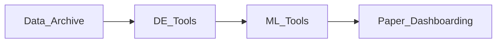

## Map of Content

The [[Data Archive]] is continuously growing! New contents will follow the direction of [[Questions]]. The [[Data Archive]] is the entry point of my ==Research-Pipeline==. We track on going tasks for it [here](https://docs.google.com/spreadsheets/d/1PMMFXlFfYjfba5VZQBVGcdtpXVQjPfDAL_MnDBobR1Y/edit?gid=0#gid=0)).

## Navigation

Here are some starting [[Tags]], see  #portal for useful navigation notes.

| [[Data Science]]                                                                                                                      |
| ------------------------------------------------------------------------------------------------------------------------------------- |
|  #classifier #regressor #evaluation #clustering  #deep_learning #anomaly_detection #model_architecture  #model_algorithm  |

| [[Machine Learning Operations]]                                                                                                                                    |
| ------------------------------------------------------------------------------------------------------------------------------------------------------------------ |
| #ml_process #ml_optimisation #model_explainability                                                                                                              |

| [[Language Models]]                                                                                                     |
| ----------------------------------------------------------------------------------------------------------------------- |
| #GenAI #language_models #NLP                                                                                         |

| [[Data Engineer\|Data Engineering]]                                                                                        |
| -------------------------------------------------------------------------------------------------------------------------- |
| #database #data_storage  #data_modeling #data_cleaning #data_exploration  #data_transformation  #data_processing  |

| [[DevOps]]                                                                                      |
| ----------------------------------------------------------------------------------------------- |
| #software  #data_orchestration #software #business  #code_snippet #software_architecture  |

| [[Career Interest]]                                                                              |
| --------------------------------------------------------------------------------------------------- |
| #career #energy                                                                                     |

| [[Data Analysis]]                                                                                |
| --------------------------------------------------------------------------------------------------- |
| #data_visualization                                                                                 |

| [[Mathematics]]                                                                                  |
| --------------------------------------------------------------------------------------------------- |
| #statistics #math                                                                                   |

| [[pages/Tasks\|Tasks]]                                                                           |
| --------------------------------------------------------------------------------------------------- |
| #drafting #question                                                                                 |

| [[Data Terms]]                                                                |
| ----------------------------------------------------------------------------- |
| #data_quality #data_governance #data_management  #field #communication  |
