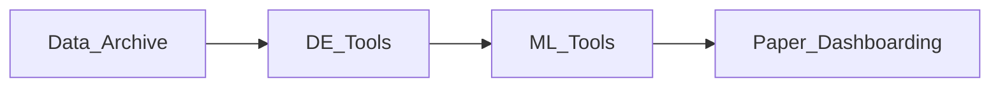

## Map of Content

The [[Data Archive]] is continuously growing! New contents will follow the direction of [[Questions]]. The [[Data Archive]] is the entry point of my ==Research-Pipeline==. We track on going tasks for it [here](https://docs.google.com/spreadsheets/d/1PMMFXlFfYjfba5VZQBVGcdtpXVQjPfDAL_MnDBobR1Y/edit?gid=0#gid=0)).

## Navigation

Here are some starting tags. For other navigation notes see #portal 

| [[DS & ML Portal]]                                                                                                                                                                       |
| ---------------------------------------------------------------------------------------------------------------------------------------------------------------------------------------- |
|  #classifier #regressor #evaluation #clustering  #deep_learning #anomaly_detection #model_architecture  #model_algorithm #ml_process #ml_optimisation  #model_explainability |

| [[Data Engineering Portal]]                                                                                                                                                                                                                                                                                                                                                                                                                       |
| ------------------------------------------------------------------------------------------------------------------------------------------------------------------------------------------------------------------------------------------------------------------------------------------------------------------------------------------------------------------------------------------------------------------------------------------------- |
| #database #data_storage  #data_modeling #data_cleaning #data_exploration  #data_transformation  #data_processing #database_optimisation #data_engineering  #data_quality #data_governance #data_management  #field #communication #big_data #event_driven  #data_visualization #business_intelligence #cloud_computing #data_streaming #database_design #data_workflow #data_collection #querying  #relational_database   |

| [[Software Development Portal]]                                                                 |
| ----------------------------------------------------------------------------------------------- |
| #software  #data_orchestration #software  #business #code_snippet #software_architecture  |

| Misc                      |
| ---------------------------- |
| #career #energy              |
| #GenAI #language_models #NLP |
| #drafting #question          |
| #statistics #math            |
