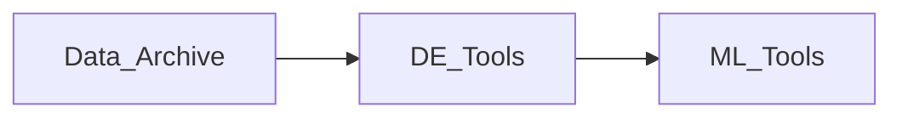

## Map of Content

The [[Data Archive]] is continuously growing! New contents will follow the direction of [[Queries]]. The [[Data Archive]] is the entry point of my ==Research-Pipeline==.  Track on going tasks for it [here](https://docs.google.com/spreadsheets/d/1PMMFXlFfYjfba5VZQBVGcdtpXVQjPfDAL_MnDBobR1Y/edit?gid=0#gid=0)).

## Navigation

Here are some starting tags. For other navigation notes see #portal 

### [[DS & ML Portal]]

**Focus**: specific types of models and learning approaches

| #classifier #regressor #clustering #deep_learning #anomaly_detection |
| ----------------------------------------------------------------------- |

**Focus**: modeling techniques, ML lifecycle, explainability

| #ml_process  #ml_optimisation #model_explainability #evaluation |
| ------------------------------------------------------------------ |

**Focus**: ML model structure, algorithms, and architecture 

| #model_algorithm #model_architecture |
| ------------------------------------ |

### [[Data Engineering Portal]]

**Focus**: working with data in motion — cleaning, transforming, and processing

| #data_cleaning #data_transformation #data_processing #data_engineering |
| ------------------------------------------------------------------------- |

**Focus**: managing, securing, and validating data across systems

| #data_governance #data_management #data_quality |
| ----------------------------------------------- |

**Focus**: designing and optimizing data systems and databases

| #database #database_design #relational_database #database_optimisation #data_storage #data_modeling |
| ------------------------------------------------------------------------------------------------------ |

**Focus**: orchestration, architecture, streaming, and event-driven systems 

| #event_driven #data_orchestration #data_streaming #data_workflow #cloud_computing #relational_database #querying #big_data |
| -------------------------------------------------------------------------------------------------------------------------------- |

### [[Data Analysis Portal]]

**Focus**: Data communication, analysis

| #data_exploration #communication #data_visualization #business_intelligence |
| ------------------------------------------------------------------------------ |

### [[Software Development Portal]]

**Focus**: Software development, tools

| #software  #data_orchestration #software  #business #code_snippet #software_architecture |
| ------------------------------------------------------------------------------------------- |

### Others

**Focus**: Computational tags

| #statistics #math |
| ----------------- |

**Focus**: GenAI, LLMs, NL

| #GenAI #language_models #NLP |
| ---------------------------- |

**Focus**: notes about notes, questions, career & domains

| #career #field #question #drafting  #business   |
| ----------------------------------------------------- |

