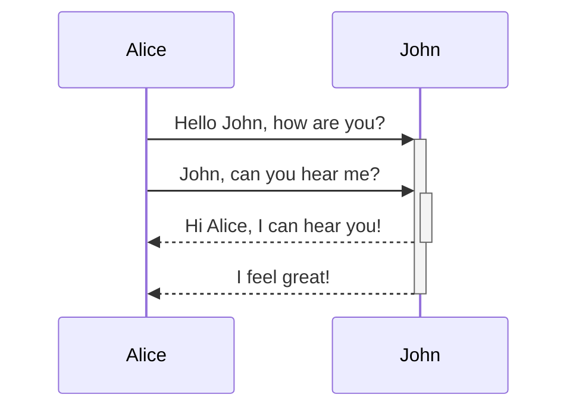

### Burn Out

[We're burned out. Here's why.](https://www.youtube.com/watch?v=8ZU8nTC7zXs)

![[Pasted image 20241220073053.png]]

To do things that matter because we care about it. To see purpose in it, and use our time well.

### Leadership

> Don't listen to what leaders say. Watch what they do.

### Work

![[Pasted image 20250118151725.png|500]]

