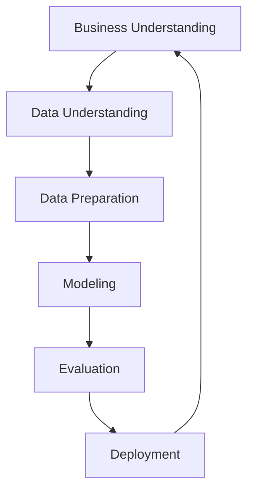

CRISP-DM stands for Cross-Industry Standard Process for [[Data Mining]], a widely adopted framework that provides a structured approach to planning, organizing, and conducting data mining projects. CRISP-DM provides a flexible, iterative process that allows for refinement at any stage, making it adaptable to various industries and types of data mining projects.

### Process

[[Data Understanding]]
   
[[Data Understanding]]
   
[[Data Preparation]]

[[Data Modelling]]
   
[[Data Evaluation]]
   
[[Data Deployment]]

