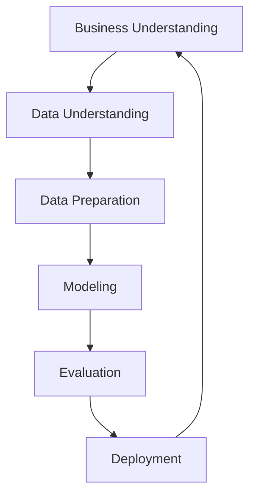

**CRISP-DM** stands for **Cross-Industry Standard Process for Data Mining**, a widely adopted framework that provides a structured approach to planning, organizing, and conducting data mining projects. It was developed in 1996 by Daimler-Benz, SPSS, and NCR. 

CRISP-DM provides a flexible, iterative process that allows for refinement at any stage, making it adaptable to various industries and types of data mining projects.

1. **Business Understanding**: Focuses on understanding the project’s objectives from a business perspective. The goal is to translate the business problem into a data mining problem.
   
2. **Data Understanding**: Involves collecting, exploring, and understanding the data to ensure its quality and to get insights relevant to the problem.
   
3. **Data Preparation**: This phase includes all activities needed to construct the final dataset, such as data cleaning, transformation, and feature selection.
   
4. **Modeling**: Various modeling techniques are applied to the data, and parameters are tuned to improve performance. Models like decision trees, neural networks, or clustering may be used.
   
5. **Evaluation**: The model is thoroughly evaluated to ensure it meets the business objectives and provides actionable insights.
   
6. **Deployment**: The final model is deployed in a production environment. This could involve automating a process, generating reports, or integrating the model into a decision-support system.

