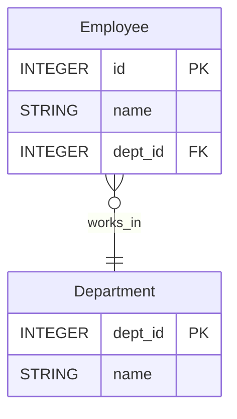

ER Diagrams are a visual representation of the database structure.

Related:
- [[Why use ER diagrams]]
- [[Mermaid]]
#### Example

Entities are tables in the database. Here, we have:

- `Employee` table
- `Department` table

Attributes (Columns)
- Each entity has attributes (columns):

Relationship
- ==Each Employee belongs to one Department==
- Each Department has many Employees.
- This is a One-to-Many (1:M) relationship.

Mermaid ER Diagram

Explanation of the Arrows

- `}o--||` → One-to-Many (1:M)
- One Department (`||`) can have many Employees (`}o`).
- Each Employee belongs to one Department.
